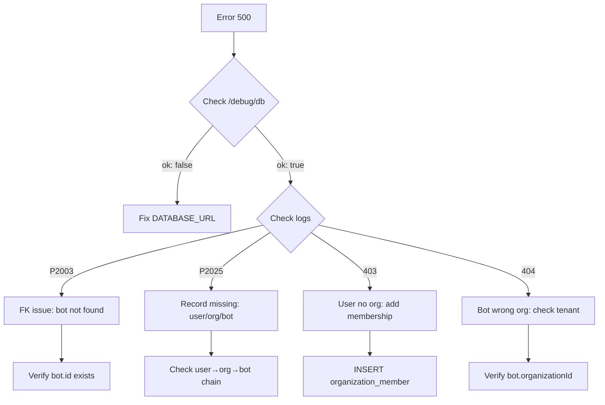

# Documents API - Troubleshooting & Deploy Guide

## 🔴 Problemi Risolti

### 1. GET /api/bots/:botId/documents → 500 "Failed to fetch documents"
### 2. POST /api/bots/:botId/documents → 500 "Database error"

---

## ✅ Correzioni Implementate

### 1. **Try/Catch con Error Mapping su GET**
```typescript
// ✅ Ora con gestione errori completa
app.get('/api/bots/:botId/documents', authMiddleware, async (c) => {
  try {
    // Tenant-safe check: user → org → bot
    const membership = await getOrganizationId(prisma, user.userId);
    const bot = await ensureBotAccess(prisma, botId, membership.organizationId);
    
    const docs = await prisma.document.findMany({
      where: { botId },
      select: { id: true, title: true, content: true, createdAt: true },
      orderBy: { createdAt: 'desc' },
    });
    
    return c.json({ documents: docs });
  } catch (error: any) {
    console.error('[GET /documents] Database error:', error);
    
    // Map Prisma errors
    if (error.code === 'P2025') return c.json({ error: 'Resource not found' }, 404);
    if (error.code === 'P2003') return c.json({ error: 'Invalid foreign key' }, 400);
    
    return c.json({ 
      error: 'Database error', 
      code: error.code, 
      message: error.message 
    }, 500);
  }
});
```

### 2. **Try/Catch con Error Mapping su POST**
```typescript
// ✅ Ora con logging dettagliato errori Prisma
app.post('/api/bots/:botId/documents', authMiddleware, async (c) => {
  try {
    // Validate
    if (!title || !content) return c.json({ error: 'title and content required' }, 400);
    
    // Tenant-safe check
    const membership = await getOrganizationId(prisma, user.userId);
    const bot = await ensureBotAccess(prisma, botId, membership.organizationId);
    
    // Create (schema: id, botId, title, content, createdAt)
    const doc = await prisma.document.create({
      data: { botId, title, content },
    });
    
    return c.json(doc, 201);
  } catch (error: any) {
    console.error('[POST /documents] Error:', error.code, error.meta);
    
    // Prisma error codes
    if (error.code === 'P2003') {
      return c.json({ 
        error: 'Foreign key constraint failed', 
        details: 'Bot does not exist',
        code: 'P2003'
      }, 409);
    }
    if (error.code === 'P2025') return c.json({ error: 'Record not found' }, 404);
    if (error.code === 'P2002') return c.json({ error: 'Unique constraint' }, 409);
    
    return c.json({ error: 'Database error', code: error.code }, 500);
  }
});
```

### 3. **Health-Check Database**
```typescript
// ✅ Nuovo endpoint per diagnostica
app.get('/api/v1/debug/db', async (c) => {
  try {
    const prisma = getDB(c.env.DATABASE_URL);
    await prisma.$queryRaw`SELECT 1 as test`;
    
    const counts = {
      users: await prisma.user.count(),
      organizations: await prisma.organization.count(),
      bots: await prisma.bot.count(),
      documents: await prisma.document.count(),
    };
    
    return c.json({ ok: true, database: 'connected', counts });
  } catch (error: any) {
    console.error('[DEBUG /db] Failed:', error);
    return c.json({ 
      ok: false, 
      error: error.message, 
      code: error.code 
    }, 500);
  }
});
```

---

## 📋 Schema Document Attuale

Il model `Document` in `schema.prisma` ha **solo questi campi**:

```prisma
model Document {
  id        String   @id @default(cuid())
  botId     String
  bot       Bot      @relation(fields: [botId], references: [id], onDelete: Cascade)
  title     String
  content   String   @db.Text
  createdAt DateTime @default(now())

  @@index([botId])
  @@map("documents")
}
```

### ⚠️ NON ha:
- ❌ `organizationId` 
- ❌ `createdByUserId`
- ❌ `name` (usa `title`)

### ✅ Se vuoi aggiungere multi-tenant tracking:
```prisma
model Document {
  id               String   @id @default(cuid())
  botId            String
  title            String   @db.VarChar(255)
  content          String   @db.Text
  organizationId   String   // ← Aggiungi questo
  createdByUserId  String   // ← E questo
  createdAt        DateTime @default(now())

  bot           Bot          @relation(fields: [botId], references: [id], onDelete: Cascade)
  organization  Organization @relation(fields: [organizationId], references: [id], onDelete: Cascade)
  createdBy     User         @relation(fields: [createdByUserId], references: [id], onDelete: SetNull)

  @@index([botId])
  @@index([organizationId])
  @@map("documents")
}
```

**Poi esegui**:
```bash
npx prisma migrate dev --name add_document_org_tracking
```

---

## 🚀 Deploy in Produzione (Cloudflare Workers)

### Step 1: Verifica Environment Variables
```bash
# Cloudflare dashboard → Workers → api-worker → Settings → Variables
- DATABASE_URL          (con ?pgbouncer=true per Neon)
- JWT_SECRET
- JWT_REFRESH_SECRET
```

### Step 2: Applica Migrations
```bash
# Nel folder packages/database
cd packages/database

# Applica tutte le migrations al DB di produzione
npx prisma migrate deploy

# Genera Prisma Client aggiornato
npx prisma generate
```

### Step 3: Deploy Worker
```bash
cd apps/api-worker

# Deploy su Cloudflare
npm run deploy
# oppure
wrangler publish
```

### Step 4: Test Health-Check
```bash
# Test connessione DB
curl https://your-worker.workers.dev/api/v1/debug/db

# Expected response (se OK):
{
  "ok": true,
  "database": "connected",
  "counts": {
    "users": 5,
    "organizations": 3,
    "bots": 2,
    "documents": 10
  }
}
```

---

## 🔍 Diagnostica Errori

### Error P2003: Foreign Key Constraint
```json
{
  "error": "Foreign key constraint failed",
  "code": "P2003"
}
```
**Causa**: `botId` non esiste o è stato cancellato  
**Fix**: Verifica che il bot esista ed appartenga all'org dell'utente

### Error P2025: Record Not Found
```json
{
  "error": "Record not found",
  "code": "P2025"
}
```
**Causa**: Query su record inesistente (user, org, bot)  
**Fix**: Controlla i tenant assignments (user → org → bot)

### Error P2002: Unique Constraint
```json
{
  "error": "Unique constraint violation",
  "code": "P2002"
}
```
**Causa**: Tentativo di creare record duplicato  
**Fix**: Cambia valore del campo unique

### Error: "User has no organization"
```json
{
  "error": "User has no organization assigned",
  "status": 403
}
```
**Causa**: User esiste ma non ha record in `OrganizationMember`  
**Fix**: 
```sql
-- Verifica
SELECT u.id, u.email, om.organizationId 
FROM users u 
LEFT JOIN organization_members om ON u.id = om.userId;

-- Se userId=xxx non ha org, creane una
INSERT INTO organization_members (id, organizationId, userId, role, createdAt)
VALUES ('cuid_xxx', 'org_id', 'user_id', 'OWNER', NOW());
```

---

## 🛠️ Quick Checks

### 1. Database Connettato?
```bash
curl https://your-api.workers.dev/api/v1/debug/db
```
✅ Se `ok: true` → DB funziona  
❌ Se `ok: false` → Controlla `DATABASE_URL` e connessione

### 2. Tabella Documents Esiste?
```sql
-- PostgreSQL
\dt documents

-- MySQL
SHOW TABLES LIKE 'documents';

-- Descrivi struttura
\d documents  -- PostgreSQL
DESCRIBE documents;  -- MySQL
```

### 3. User Ha Organization?
```sql
SELECT u.email, o.name as org_name, om.role
FROM users u
JOIN organization_members om ON u.id = om.userId
JOIN organizations o ON om.organizationId = o.id
WHERE u.email = 'tuo@email.com';
```

### 4. Bot Appartiene a Org Corretta?
```sql
SELECT b.id, b.name, b.organizationId, o.name as org_name
FROM bots b
JOIN organizations o ON b.organizationId = o.id
WHERE b.id = 'bot_id_qui';
```

---

## 🔄 Prisma Accelerate (Workers)

Se usi Cloudflare Workers e hai errori intermittenti:

```bash
# 1. Abilita Prisma Accelerate (connection pooling)
npm install @prisma/extension-accelerate
```

```typescript
// 2. In apps/api-worker/src/index.ts
import { withAccelerate } from '@prisma/extension-accelerate';

const getDB = (databaseUrl: string) => {
  const pool = new Pool({ connectionString: databaseUrl });
  const adapter = new PrismaNeon(pool);
  return new PrismaClient({ adapter }).$extends(withAccelerate());
};
```

```bash
# 3. Aggiungi PRISMA_ACCELERATE_URL in Cloudflare vars
# (Neon fornisce questo URL se abiliti Accelerate)
```

---

## 📊 Logging Avanzato

Per debugging produzione, aggiungi:

```typescript
// Nel catch block
catch (error: any) {
  console.error('[POST /documents] Full error:', {
    code: error.code,
    message: error.message,
    meta: error.meta,
    clientVersion: error.clientVersion,
    stack: error.stack?.split('\n').slice(0, 3),
    botId,
    userId: user.userId,
    timestamp: new Date().toISOString()
  });
  // ... rest of error handling
}
```

Poi in Cloudflare dashboard → Workers → Logs → Real-time Logs

---

## ✅ Checklist Pre-Deploy

- [ ] `npx prisma migrate deploy` eseguito su DB prod
- [ ] `DATABASE_URL` contiene `?pgbouncer=true` (se Neon)
- [ ] `JWT_SECRET` e `JWT_REFRESH_SECRET` settati in Cloudflare
- [ ] Test `/api/v1/debug/db` → `ok: true`
- [ ] User ha `organizationId` in `organization_members`
- [ ] Bot ha `organizationId` che matcha user's org
- [ ] Prisma Client generato: `npx prisma generate`
- [ ] CORS origins includono il tuo dominio frontend

---

## 🆘 Errori Comuni & Fix Rapidi

| Errore | Causa | Fix |
|--------|-------|-----|
| `P2003` | FK non valida | Bot non esiste o non è nell'org |
| `P2025` | Record not found | User/Org/Bot missing in DB |
| `P2002` | Unique constraint | Campo duplicato (email, slug, ecc.) |
| `403 no organization` | User senza org | Crea `OrganizationMember` record |
| `404 bot not found` | Bot in altra org | Verifica `bot.organizationId` |
| `500 Database error` | Connection/migration | Controlla `DATABASE_URL` e migrations |

---

## 📞 Debug Flow



---

## 🎯 Test Finale

```bash
# 1. Login
curl -X POST https://your-api.workers.dev/api/v1/auth/login \
  -H "Content-Type: application/json" \
  -d '{"email":"test@test.com","password":"password"}'
# → Salva accessToken

# 2. Get documents
curl https://your-api.workers.dev/api/bots/BOT_ID/documents \
  -H "Authorization: Bearer YOUR_TOKEN"
# → Deve tornare 200 con array documents

# 3. Create document
curl -X POST https://your-api.workers.dev/api/bots/BOT_ID/documents \
  -H "Authorization: Bearer YOUR_TOKEN" \
  -H "Content-Type: application/json" \
  -d '{"title":"Test Doc","content":"Content here"}'
# → Deve tornare 201 con nuovo document
```

---

## 📝 Note Finali

1. **CORS è già globale** in `index.ts` con `app.use('/*', cors(...))` → nessuna modifica necessaria
2. **Schema minimale** funziona, ma considera aggiungere `organizationId` per audit migliori
3. **Error mapping** ora copre P2003, P2025, P2002 + fallback generico
4. **Logging** con prefix `[GET/POST /documents]` per grep facile nei Cloudflare logs
5. **Tenant-safe**: ogni operazione verifica `user → org → bot` chain

---

**Status**: ✅ Codice aggiornato e pronto per deploy  
**Next**: Deploy su Cloudflare e testa `/debug/db` + `/bots/:id/documents`
